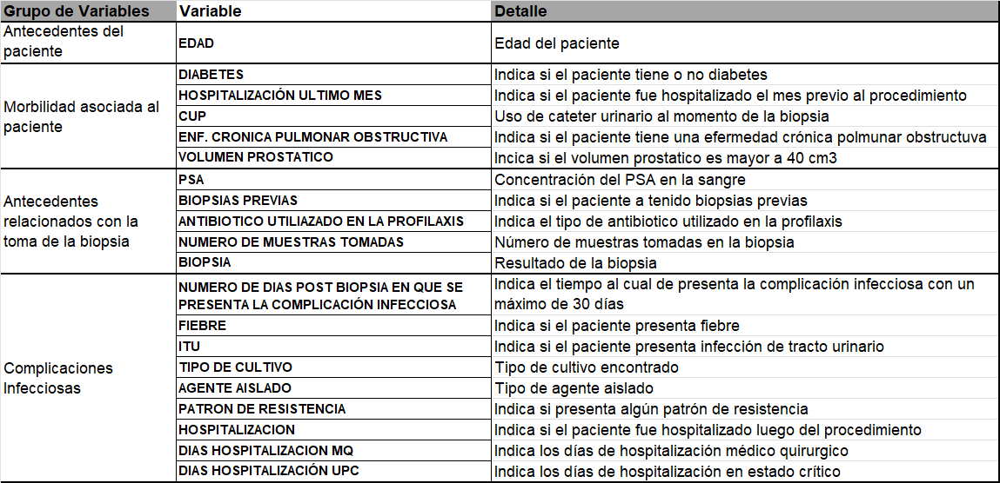

# Modelo de Machine Learning para la Detección de Hospitalización de Pacientes

En el proyecto que se presenta a continuación, formamos parte del equipo de ciencia de datos de una consultora de renombre y un ciente llegó con un proyecto relacionado al estudio de atención en salud para un importante hospital. **El cliente desea saber las características más importantes que tienen los pacientes de cierto tipo de enfermedad que terminan en hospitalización.** Fue definido como caso, aquel paciente que fue sometido a biopsia prostática y que en un periodo máximo de 30 días posteriores al procedimiento presentó fiebre, infección urinaria o sepsis; requiriendo manejo médico ambulatorio u hospitalizado para la resolución de la complicación.

Para poder llevar a cabo este proyecto, se crearon varios modelos de Machine Learning que pudieran dectectar la hospitalización de un paciente de acuerdo a su historial clínico. Esto con la finalidad de evaluar que características son las más relevantes a la hora de que un paciente termine o no hospitalizado.

## Diccionario de Datos

El departamento de datos puso a disposición información relacionada a `Antecedentes del paciente`, `Morbilidad asociada al paciente`, `Antecedentes relacionados con la toma de la biopsia` y `Complicaciones infecciosas` dentro del dataset "BBDD_Hospitalizacion". Este documento se encuentra disponible en la carpeta src en el repositorio del proyecto.

En la siguiente tabla, se encuentra un diccionario de datos asociado:

## Desarrollo del proyecto

Primero se comenzó realizando un análisis exploratorio y transformación de los datos, identificando outliers, datos faltantes o cualquier otro tipo de problema. En este proceso de renombraron las columnas, se formatearon y generalizaron las categorías y, por último, se codificaron las variables categoricas para que puedan ser entendidas por lor modelos de Machine Learning. Los resultados fueron exportados a la carpeta EDA_ETL_results de la siguiente manera:

- **Cleaned_dataset.csv**: copia del dataset con todos los datos ya limpiados y sin codificar.
- **Encoded_dataset.csv**: copia del dataset con todas las variables categóricas preprocesadas.
- **DictEncoding.json**: resultados de la codifcación realizada para las variables categóricas en el preprocesamiento de datos.

Luego, con el archivo Encoded_dataset.csv se procedió a entrenar diferentes modelos de Machine Learning capaces de detectar la hospitalización de un paciente. Esto se encuentra en el notebook Ml_Model.ipynb. En el preceso se hizo un oversampling de los datos de entrenamiento y por cada modelo, un ajuste de hiperparámetros con el fin de obtener los mejores resultados posibles. Por último, estos se evaluaron usando las siguientes métricas de evaluación: Matriz de confusión y Reporte de clasificación; y se obtuvieron las conclusiones a la solicitud del cliente.

## Conclusión del projecto

Se logró crear un modelo k-vecinos capaz de clasificar si un paciente fue hospitalizado o no con un 99% de fiabilidad, utilizando variables relacionadas con la aparición de complicaciones infecciosas. Previamente, se había logrado corroborar que estas son determinantes a la hora de que un paciente termine o no hospitalizado.

Por otro lado, el resto de las variables también fueron evaluadas usando tres modelos de Machine Learnign: K- Vecinos, Arbol de desición y Máquina de Vectores de Soporte. El modelo de Máquina de Vectores de Soporte fue el que mejor resultado obtuvo de los tres, pero las métricas de evaluación mostraron resultados poco favorables cuando el paciente si fue hospitalizado. Este modelo solo logró clasificar correctamente de un total de 170 muestras a la mitad de los pacientes cuando si fueron hospitalizados, por lo que se pudo concluir que las variables relacionadas con la Morbilidad del paciente y con los Antecendetes de la toma Biopsia no determinan si un paciente será o no hospitalizado.

En cuanto a la petición del cliente, las características más importantes que tienen los pacientes de cierto tipo de enfermedad que terminan en hospitalización son aquellas relacionadas con complicaciones infecciosas:

- La aparición de complicación infecciosa.
- Fiebre
- Infección del trato urinario.
- Presencia de algún tipo de cultivo.
- Presencia de Patrones de Resistencias.
- Presencia de algún tipo de Agente Aislado.
